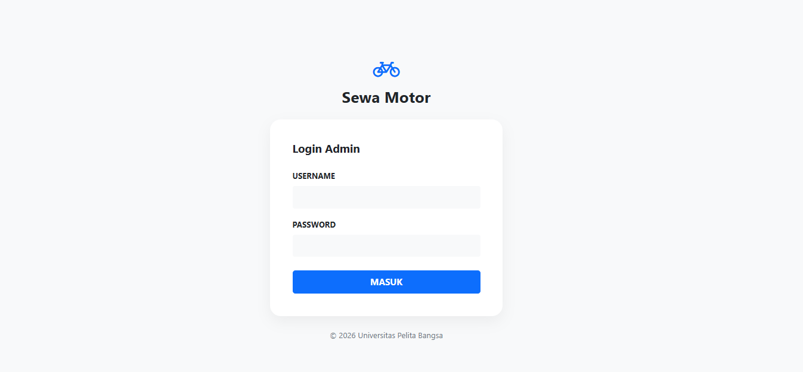
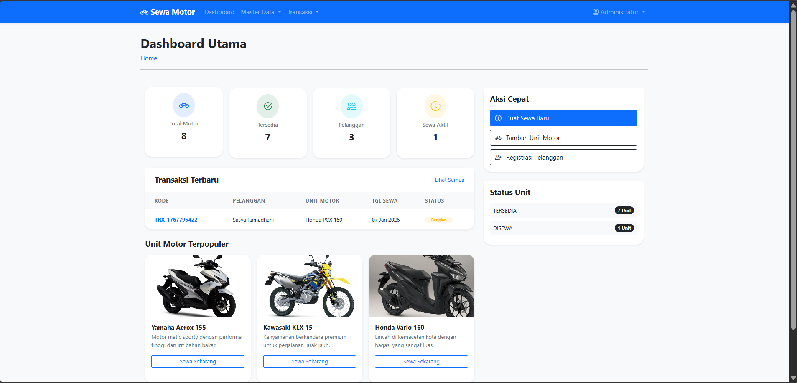
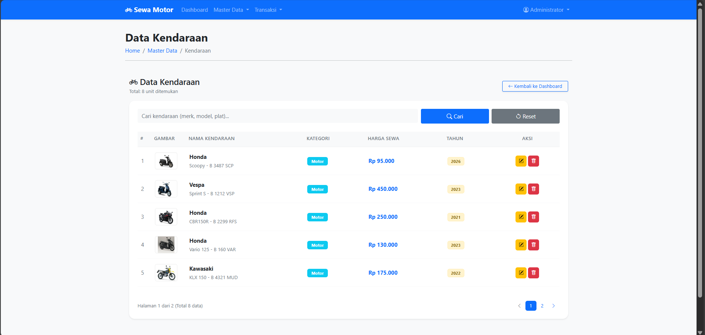
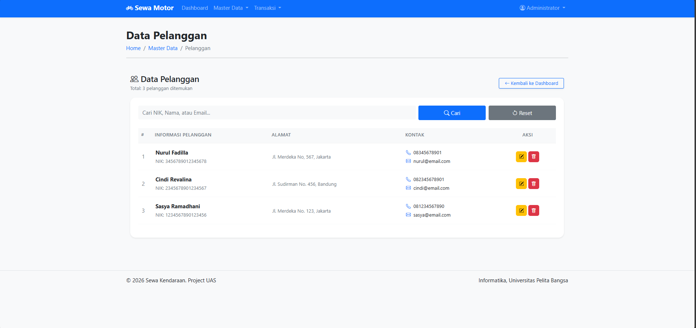
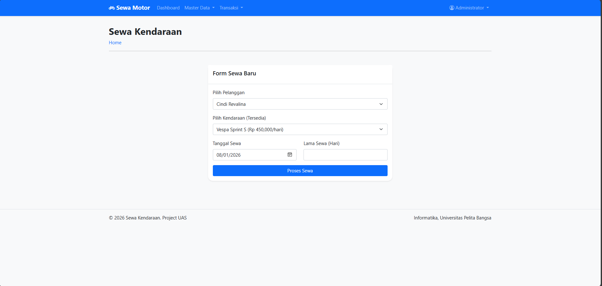
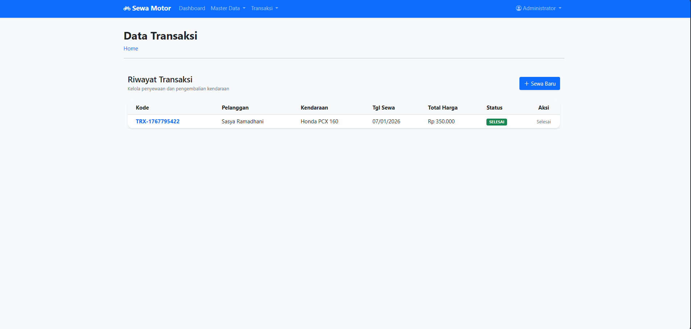

# project UAS

## Deksripsi Project
Proyek ini dikembangkan sebagai Proyek Akhir (UAS). Fokus utama aplikasi adalah memberikan antarmuka yang modern (inspirasi desain Skincare/Minimalis) dengan fungsionalitas CRUD (Create, Read, Update, Delete) yang lengkap dan sistem autentikasi yang aman.

## Struktur Project
```
sewa-kendaraan/
├── index.php (dashboard)
├── config/
│   └── database.php
├── views/
│   ├── auth/
│   │   ├── login.php
│   │   └── logout.php
│   ├── kendaraan/
│   │   ├── create.php
│   │   ├── delete.php
│   │   ├── edit.php
│   │   └── index.php
│   ├── pelanggan/
│   │   ├── create.php
│   │   ├── delete.php
│   │   ├── edit.php
│   │   └── index.php
│   ├── transaksi/
│   │   ├── delete.php
│   │   ├── edit.php
│   │   └── index.php
├── includes/
│   ├── auth-check.php
│   ├── footer.php
│   └── header.php
└── assets/
    ├── css/
    └── img/
```

## Fitur Utama
- Sistem Autentikasi Admin: Proteksi halaman yang mewajibkan user untuk login terlebih dahulu sebelum dapat mengakses dashboard.
- Manajemen Armada (Master Data): Pengelolaan data motor yang mencakup merk, model, plat nomor, tahun produksi, hingga unggah foto unit.
- Pagination Cerdas: Tabel data kendaraan dibatasi maksimal 5 data per halaman untuk menjaga kecepatan dan kerapihan tampilan.
-Manajemen Pelanggan: Pendataan NIK, nama, alamat, dan kontak pelanggan secara terpusat.
- Sistem Transaksi & Denda:
    - Pencatatan penyewaan dengan pemilihan unit yang tersedia saja.
    - Perhitungan denda otomatis (50% dari harga sewa per hari) jika terjadi keterlambatan pengembalian.
- Dashboard Statistik: Ringkasan jumlah motor, unit tersedia, total pelanggan, dan transaksi aktif dalam bentuk kartu statistik yang modern.

## Teknologi yang Digunakan
- Bahasa Pemrograman: PHP 8.x.
- Database: MySQL (MariaDB).
- Framework CSS: Bootstrap 5.3 (via CDN).
- Ikon: Bootstrap Icons.
 Library Lain: PDO (PHP Data Objects) untuk koneksi database yang lebih aman dari SQL Injection.

## Screenshot Aplikasi
1. Halaman Login
halaman awal untuk masuk ke sistem menggunakan username dan password.


2. Dashboard Utama
Menampilkan statistik unit motor, pelanggan, transaksi aktif, serta ringkasan riwayat terbaru.


3. Data motor
Menamapilkan Data motor dengan sistem pagination dan fitur pencarian data.


4. Data Pelanggan
Menampilkan data pelanggan dengan fitur pencarian data.


5. Form Sewa motor
Proses input transaksi baru dengan pemilohan pelanggan dan unit yang sedang tersedia.


6. Proses Pengembalian
Sistem otomatis menghitung denda jika tanggal kembali aktual melewati batas waktu yang diitentukan.


### Akses:
http://localhost/sewa-kendaraan/index.php

### Dokumentasi Video:
https://youtu.be/BnWaGMagMcw?feature=shared 